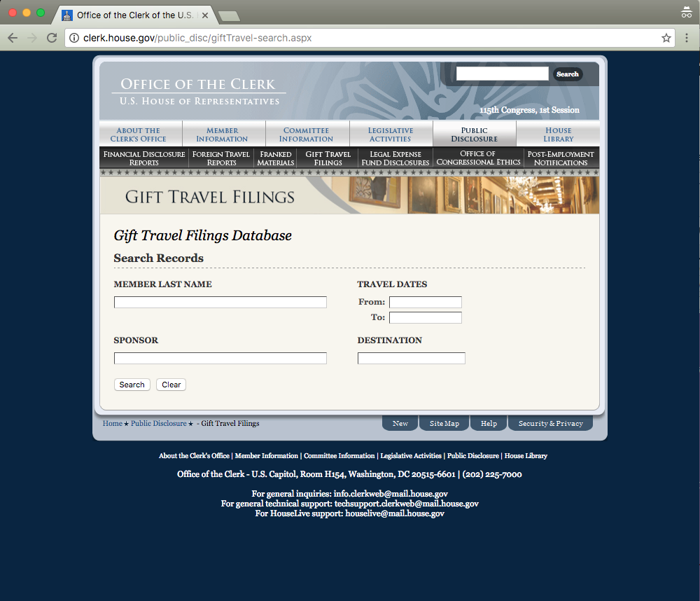
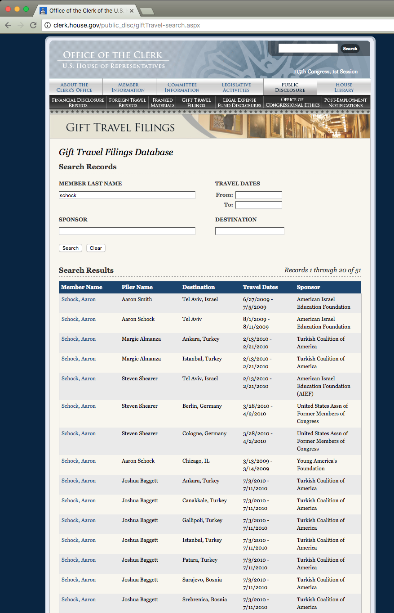

Mirror page:

https://wgetsnaps.github.io/clerk.house.gov--giftTravel/public_disc/giftTravel.aspx.html

Original page:

http://clerk.house.gov/public_disc/giftTravel.aspx

Note:

The Filing search and source PDFS aren't mirrored. Here's a screenshot of what the database search looks like:

http://clerk.house.gov/public_disc/giftTravel-search.aspx

Here's a sample results page:

## wget used to get the page

~~~sh
wget --mirror \
  --adjust-extension \
  --backup-converted  \
  --convert-links \
  --no-host-directories \
  --no-parent \
  --output-file /dev/stdout \
  http://clerk.house.gov/public_disc/giftTravel.aspx \
| tee ./wget.log
~~~
